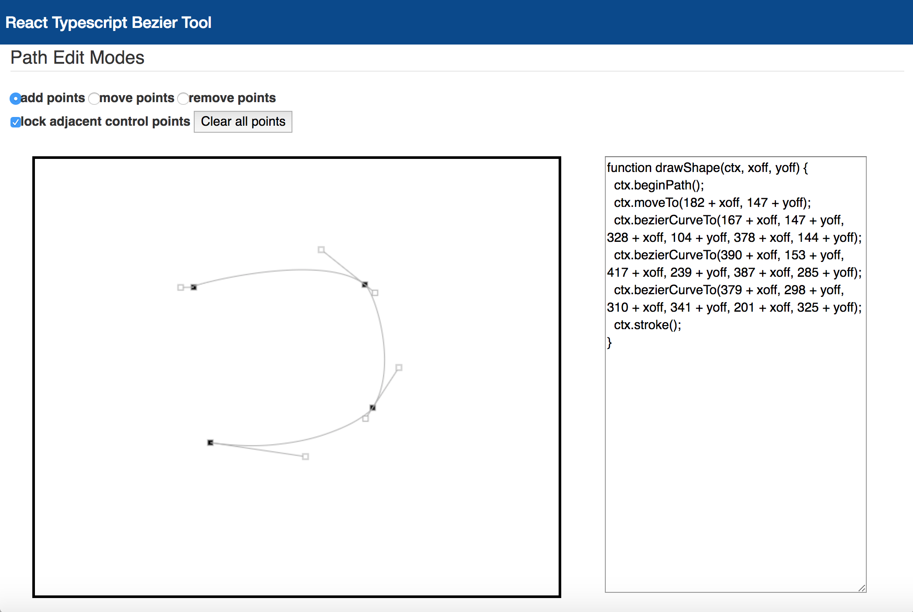

# bezier-tool




A react, typescript bezier tool. Based on [http://www.victoriakirst.com/beziertool/](http://www.victoriakirst.com/beziertool/).

[http://wwlib.github.io/bezier-tool/](http://wwlib.github.io/bezier-tool/)  

Note: This is a work in-progress...

```
yarn
yarn start

http://localhost:3000/
```
